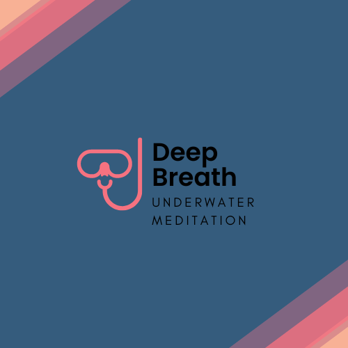

<h1>Deep Breath</h1>

Deep Breath is a site that documents the benefits of scuba diving while incorporating deep breathing exercises. It will be useful for people interested in taking care of their well being, and finding out more information on how to get started in partaking in underwater meditation.

<h2>Existing Features</h2>
<h3>- Navigation Bar</h3>
A full responsive navigation bar includes links to the homepage of Deep Breath, a photo Gallery, and a Contact Us section. Each section is identical in a manner to allow for easy navigation.  
 
The purpose of this feature is to allow users to easily navigate throughout different sections of the site.
 
<h3>Footer</h3>
The footer remains at the bottom of the page and provides easy links to social media pages which are always easily accessible.
 
<h3>- The landing page image</h3>

The landing page includes an image with text to grasp the users attention and allows them to identify the section that they are interested in reading.

<h3>- Gallery Page</h3>
A gallery page was added to include images for users to visualise what underwater meditation would look and feel like. It also breaks up any monotonous looking text blocks.
 
<h3>- Benefits</h3>
A benefits page was added to show users the mental and physical health benefits of scuba diving.

<h1>Potential Future Features</h1>
In the future adding a feature to index local dive shops in a users area via a mapping tool and linking them to dive shops in their locality would be beneficial rather than having to contact us and wait for a response.

 This could also be beneficial to *us* by way of commission of sales possibly.
  
 
 <h1>Testing</h1>
 On completion of the design, the site was tested across multiple browsers and platforms. The site has been built using Chrome, and so it was also tested across Microsoft Edge and Firefox for desktops and larger screen sizes, whilst tested using Safari and Chrome on mobile and tablet devices.

* Check validator websites for HTML and CSS and Accessibility when finished and save screenshots as proof here*
* use lighthouse
* accessibility is important (alt)
  
 <h3>Bugs</h3>
<h3>Credits</h3>
Used code Institute template to start off project.
Sourced some style code for adjusting photo size from various sources online :
w3schools.com
Stackoverflow.com
Rewatched Love Running project from Code Institute for inspiration on order to set up html and css.

Thanks to my fellow coding student Viola Bergere for keeping me motivated and being my second pair of eyes when I was missing a curly bracket or colon when I was fit to smash my computer out the window :)
 
template to start project
Used fonts from googlefonts
credit image sourcesc
credit other sources where necessary...
---

Happy diving!
