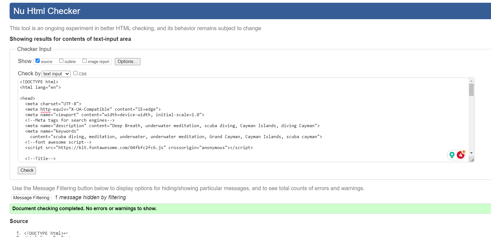

# TESTING

## Compatibility

In order to confirm the correct functionality, responsiveness, and appearance:

+ The website was tested on the following browsers: Chrome, Edge, Safari. All worked fine.

One strange bug I noticed in Incognito mode was that the Nav Menu was permanently set to the hover color, and did not change when they were hovered over. Outside incognito mode, this function worked fine.

## Responsiveness

+ The website was checked by devtools implemented in Firefox and Chrome browsers and ran through [Am I Responsive](https://ui.dev/amiresponsive)

    - Main Page:

    
    
     - Benefits Page:

    

    - Gallery Page:

    

    - Contact Page:

    

    - Response Page:

    

+ The website was checked with [Responsive Viewer Extension](https://responsiveviewer.org/).

+ The functionality of the links in the website was checked as well by various users on their own devices as secondary level of testing.

## Manual testing

| feature | action | expected result | tested | passed | comments |
| --- | --- | --- | --- | --- | --- |
| Navbar | | | | | 
| Deep Breath | Click on the "Deep Breath"text logo link | The user is redirected to the main page | Yes | Yes | - |
| Home | Click on the "Home" link | The user is redirected to the main page | Yes | Yes | - |
| Benefits | Click on the "Benefits" link | The user is redirected to the benefits page | Yes | Yes | - |
| Gallery | Click on the "Gallery" link | The user is redirected to the gallery page | Yes | Yes | - |
| Contact | Click on the "Contact" link | The user is redirected to the contact page | Yes | Yes | - |
| Footer | | | | | |
| Instagram icon in the footer | Click on the Instagram icon | The user is redirected to the Instagram page | Yes | Yes | - |
| Mailbox icon in the footer | Click on the Mailbox icon | The user is redirected to their outlook and new mail to deepbreath@gmail is opened | Yes | Yes | - |
| YouTube icon in the footer | Click on the YouTube icon | The user is redirected to the YouTube page | Yes | Yes | - |
| Home page | | | | | |
| "Discover the world of underwater meditation" link in Hero section | Click on the "Discover the world of underwater meditation" link | The user is redirected to the benefits page | Yes | Yes | - |
| "Click Here" button in benefits section | Click on the "Click Here" button | The user is redirected to the contact page | Yes | Yes | - |
| Gallery page | | | | | |
| "Back to Top" button at bottom of gallery section | Click on the "Back To Top" button | The user is redirected to top of the gallery page | Yes | Yes | - |
| Contact page | | | | | |
| First name input | Enter the first name | The users name is entered | Yes | Yes | If user doesn't enter the name, the error message appears |
| Phone Number input | Enter a phone number | The phone number is entered | Yes | Yes | 
| Email input | Enter the email | The email is entered | Yes | Yes | If user doesn't enter the email, the error message appears. If user enters not valid email, the error message appears |
| "I'm In" button | Click on the "I'm In" button | The user is redirected to the thank you page | Yes | Yes | - |

---
## Validator testing
+ ### HTML
  #### Home Page
    - No errors or warnings were found when passing through the official W3C validator.

    
    
     #### Benefit Page
    - One error was found when passing through the official W3C validator. The "Click Here" button is functioning correctly, however.

    
  #### Gallery Page
    - No errors or warnings were found when passing through the official W3C validator.

    

  #### Contact Page
    - No errors or warnings were found when passing through the official W3C validator.

    

  #### Thank You Page
    - No errors or warnings were found when passing through the official W3C validator.

    
    
+ ### CSS
  No errors or warnings were found when passing through the official W3C (Jigsaw) validator except:
    
  
  
  

+ ## LightHouse report

    - Using lighthouse in devtools in Google Chrome, I confirmed that the website is performing well on most counts, is accessible and the colors and fonts chosen are readable.
    
  ### Home page

  

  ### Benefits page

  

  ### Gallery page

  
  The performance in the Gallery Page is lower than I would like, but I fixed some of the suggestions in my code to higher it, yet the score did not change.

  ### Contact page

  

  ### Response page

  

---
​
## Bugs
+ ### Solved bugs
    1. The Gallery section was very compressed and difficult to view the individual images in smaller screens.
    
        *Solutions:* Changed the grid template columns from 2fn to various pixel values for smaller screens.
    
    2. The footer social icons were not changing color on hover
        
        *Solution:* Deleted some unnecessary code above that was overriding the color change in my .social-icon code. 

    3. An inner scroll bar was causing issues with the footer, causing it to overlap over the side of the page. 
        
        *Solution:* Disabled scrolling in the main content code.
    ---
+ ### Unsolved bugs
    - Map was throwing an error in the validator, when I deleted the warning code, the map is now smaller than I originally planned for it's container.
+ ### Mistakes
- At one point I tried to turn on the backlight of my keyboard and hit F4 and my CodeAnywhere went crazy adding and deleting all sorts of code. I pushed the code not realizing what had happened and noticed that I had 12765 lines of code, from having about 600. Opened a new workplace from the previous push before and continued working from there.
    - Mistakes were made while committing changes. I was not using present tense or starting capital letters for my sentences. Some of my commits were a little messy, entering a lot of changes in different areas at once, but I got the hang of it towards the end.
---
